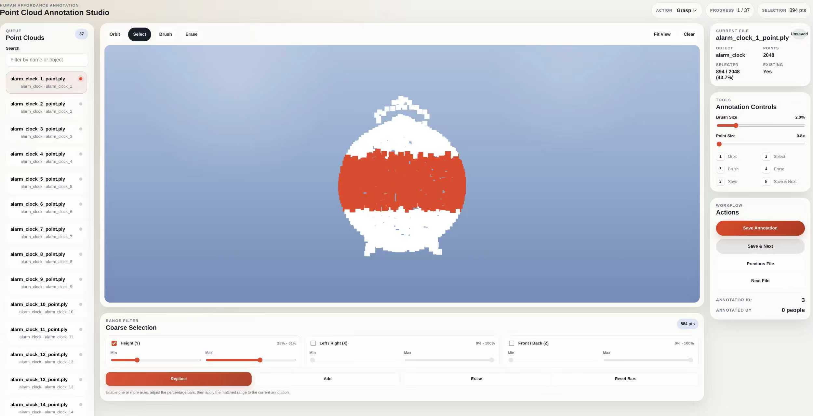
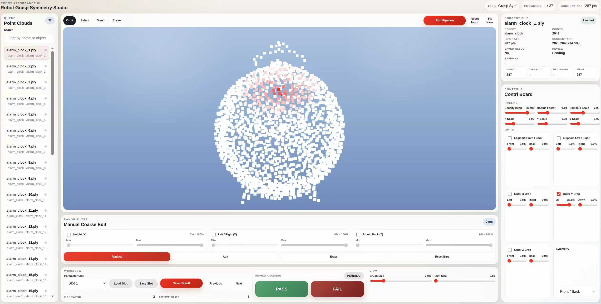

# [Fig. 1. Human Prior Affordance Annotation UI](./Human Prior Affordance Annotation UI.jpg)

# [Fig. 2. Robot Affordance Annotation UI](./Robot Affordance Annotation UI.jpg)

# [Fig. 3. Real-world robotic platform setup](./experiment_env.pdf)

# [Fig. 4. Full real-world evaluation pipeline](./full_pipeline.pdf)

# [Fig. 5. Updated method overview](./method_updated.pdf)

